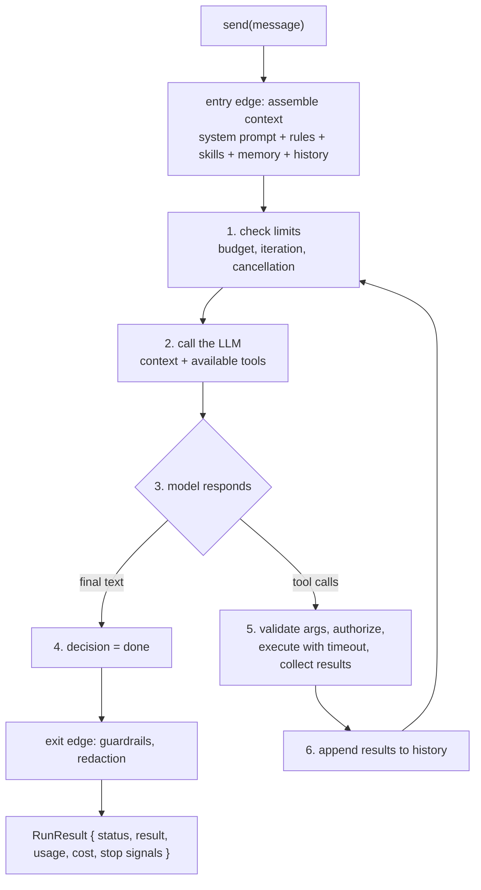

# The canonical loop

This SDK's loop is **exactly this, linearly and imperatively**
(`packages/sdk/src/internal/agent-loop/loop.ts`). That is an architectural decision with
consequences you need to know: the loop is not event-sourced, not reactive, and not
crash-resumable. See [durability boundary](/concepts/durability-boundary.md) and
[capability gaps](/project/capability-gaps.md) — the project's own `CLAUDE.md` forbids
describing it as durable or resumable.[^loop]

# The edges matter as much as the iteration

The two edges are where most consumers under-invest.

* **Entry edge** — assembling context is not plumbing, it is the single largest lever on
  quality. That is the whole of [context engineering](/concepts/context-engineering.md).
* **Exit edge** — output guardrails run here, which is why a blocked output still reports
  `usage` and `cost` while suppressing `result`. See [guardrails](/sdk/guardrails.md).

# Where the cost actually lives

The history goes in whole on **every** iteration. Therefore:

$$
\mathrm{cost}_{\text{total}} \approx \sum_{i} \left( \mathrm{tokens}_{\text{context}}(i) + \mathrm{tokens}_{\text{output}}(i) \right)
$$

and $\mathrm{tokens}_{\text{context}}$ grows **monotonically** within a run. Three practical
consequences follow, and they are not obvious:

* A tool that returns 50 KB of log does not cost "once". It costs on **every subsequent
  iteration**. The containment is `toModelOutput` — see [tools and ACI](/sdk/tools-and-aci.md).
* Reducing the **number of iterations** saves more than reducing the initial prompt.
* Prompt caching, where the provider supports it, is the highest-leverage optimization for
  agents with a large system prompt.

[Cost management](/operations/cost-management.md) orders all five levers by impact — and
notes that teams habitually start with the smallest one.

# Where it stops

The loop has seven exits, not two. Knowing all seven is the difference between a junior and
a Staff engineer on this topic: see [loop terminals](/concepts/loop-terminals.md). One of
them, [doom loop](/concepts/doom-loop.md), is a distinct state that looks like "needs more
iterations" and is not.

# Who restarts it

One cycle is described above. The orthogonal axis — **when the cycle restarts, and who
authorizes it** — decides the shape of the whole system, and is
[control cadence](/concepts/control-cadence.md).

[^course]: Agent AI course, Module 2
[^loop]: `packages/sdk/src/internal/agent-loop/loop.ts`
