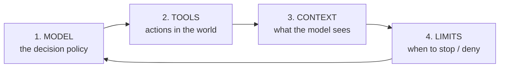

# Definition

> An agent is a program in which an LLM decides, in a loop, which action to take next —
> until it judges the task complete.[^course]

Three words carry the weight.

**decides**
: Control flow belongs to the model, not to your `if`. If you wrote the `if`, it is a workflow.

**loop**
: One call is not an agent. It is a call.

**judges complete**
: The stopping condition is also the model's decision. That is precisely why external
  limits are mandatory — see [limits and budgets](/sdk/limits-and-budgets.md).

# The contrast that resolves most confusion

| | You write | The model writes | Correct name |
| --- | --- | --- | --- |
| Prompt → response | everything | nothing | **LLM call** |
| Prompt → response → fixed prompt → response | the order | the content | **chain / pipeline** |
| Fixed steps, some with an LLM | the order | the content | **workflow** |
| Fixed steps + one choice point among N branches | the topology | the route | **routed workflow** |
| Goal + tools; order emerges | the tools and the limits | the order | **agent** |

**The golden rule is about cost, not style:** if you can draw the flowchart before running,
implement the flowchart. An agent is a flowchart you pay an LLM to rediscover on every
execution — in tokens, in latency and in variance. The
[determinism ladder](/concepts/determinism-ladder.md) is the same rule turned into a decision
procedure.

# The four mandatory components

Every agent, in every framework, has exactly these:

1. **Model** — the function `state → next action`. It is stochastic. Accept that: your
   system is a state machine with a probabilistic transition in the middle.
2. **Tools** — the only way an agent affects the world. Without tools an "agent" is a chat.
   Designing them well is [tools and ACI](/sdk/tools-and-aci.md).
3. **Context** — everything entering the window: system prompt, history, tool results,
   files, memory. **This is the component you will engineer most**; see
   [context engineering](/concepts/context-engineering.md).
4. **Limits** — iteration ceiling, budget, permissions, timeouts, guardrails. **None is
   optional in production.** An agent without limits is a scheduled incident.

Frameworks differ in *how* they expose these four. No framework removes them — which is why
the [framework comparison](/ecosystem/framework-comparison.md) compares on other axes.

# Why most agent projects fail

Five causes, in the order they appear:

1. **It was a workflow.** An agent was used because it was fashionable. Variance destroys
   user trust.
2. **No evaluation.** "It worked in my five manual tests." Without a baseline, no change is
   demonstrably an improvement. See [evaluation](/operations/evaluation.md).
3. **Unengineered context.** History was stacked until the window blew — and quality fell
   long before it blew.
4. **No limits.** A tool loop that fails and is retried unchanged burns budget in minutes.
   That is a [doom loop](/concepts/doom-loop.md).
5. **Badly designed tools.** Ambiguous names, errors the model cannot read, huge returns.
   The model is not making a mistake: it never had the information to get it right.

# Mastery criterion

You have this when you can argue, in two minutes and with nothing to consult, **against**
using an agent in a case where the team wants one — on grounds of cost, variance and
testability.

[^course]: Agent AI course, Module 1
